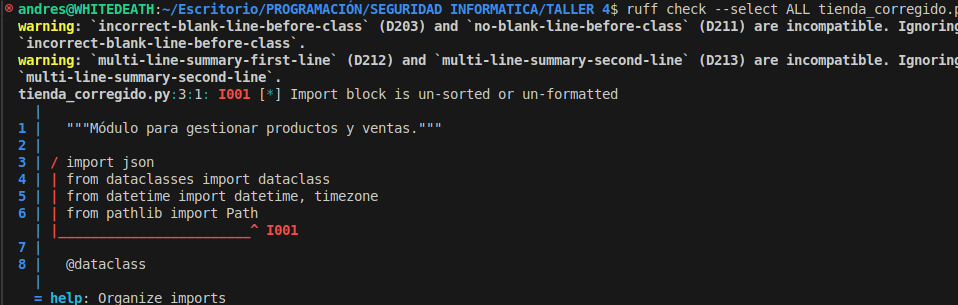
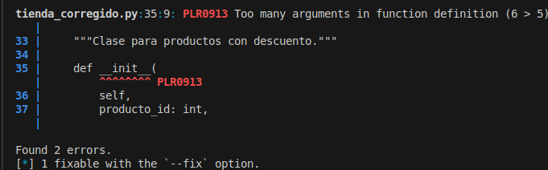

# Informe de Refactorización del Sistema de Gestión de Productos

## 1. Identificación de Violaciones SOLID

### Violación del Principio de Responsabilidad Única (SRP)
- **Problema:** La clase `GestorProductos` manejaba tanto la lógica de productos como la persistencia en base de datos.
- **Evidencia:**
  ```python
  class GestorProductos:
      def agregar_producto(self, producto):
          # Lógica de validación
          self.guardar_en_bd(producto)

      def guardar_en_bd(self, producto):
          # Conexión y guardado en base de datos
  ```
- **Solución:** Separar la lógica de negocio de la persistencia.

### Violación del Principio Abierto/Cerrado (OCP)
- **Problema:** El método `calcular_descuento` dependía de una serie de condicionales para diferentes tipos de descuentos.
- **Evidencia:**
  ```python
  class CalculadoraDescuentos:
      def calcular_descuento(self, producto):
          if producto.categoria == "electronica":
              return producto.precio * 0.1
          elif producto.categoria == "ropa":
              return producto.precio * 0.2
  ```
- **Solución:** Usar polimorfismo con una jerarquía de clases para descuentos.

## 2. Análisis de los Principios Afectados

| Principio | Violación | Solución |
|-----------|----------|----------|
| SRP | Mezcla de lógica de negocio y persistencia en `GestorProductos` | Crear una clase `RepositorioProductos` |
| OCP | Cálculo de descuentos basado en condicionales | Aplicar el patrón Estrategia |

## 3. Propuestas de Solución

### Código refactorizado aplicando SOLID

```python
class RepositorioProductos:
    def guardar(self, producto):
        # Lógica de guardado en base de datos

class EstrategiaDescuento(ABC):
    @abstractmethod
    def aplicar_descuento(self, producto):
        pass

class DescuentoElectronica(EstrategiaDescuento):
    def aplicar_descuento(self, producto):
        return producto.precio * 0.1

class DescuentoRopa(EstrategiaDescuento):
    def aplicar_descuento(self, producto):
        return producto.precio * 0.2
```

## 4. Diagrama de Clases

```plaintext
              +--------------------------+
              |    Producto              |
              |--------------------------|
              | - nombre: str            |
              | - precio: float          |
              | - categoria: str         |
              +--------------------------+
                         |
                         v
              +--------------------------+
              | RepositorioProductos     |
              |--------------------------|
              | + guardar(producto)      |
              +--------------------------+
                         |
                         v
              +--------------------------+
              | EstrategiaDescuento      |
              |--------------------------|
              | + aplicar_descuento()    |
              +--------------------------+
                         |
            ---------------------------------
            |                               |
  +--------------------------+   +--------------------------+
  | DescuentoElectronica      |   | DescuentoRopa           |
  |--------------------------|   |--------------------------|
  | + aplicar_descuento()     |   | + aplicar_descuento()     |
  +--------------------------+   +--------------------------+
```

## 5. Resultados del Análisis con Ruff

A continuación se incluyen capturas de pantalla con los resultados de Ruff antes y después de aplicar las correcciones:




